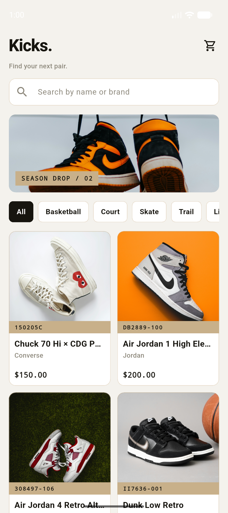
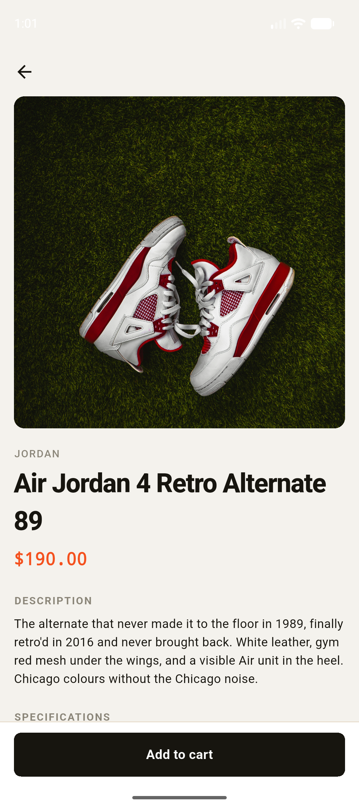
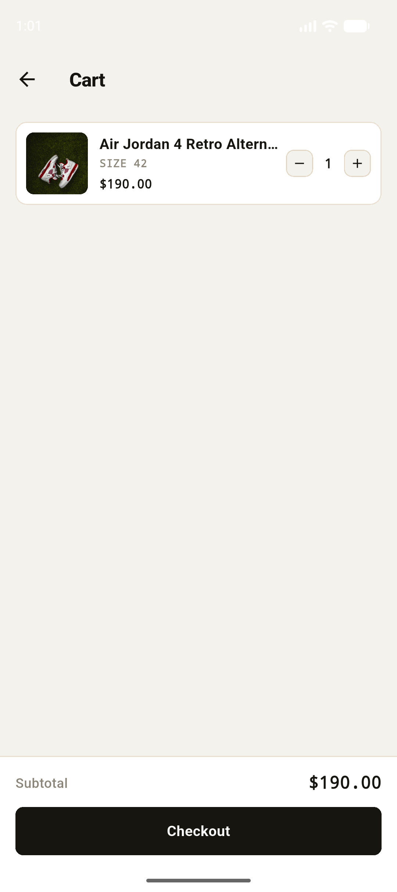
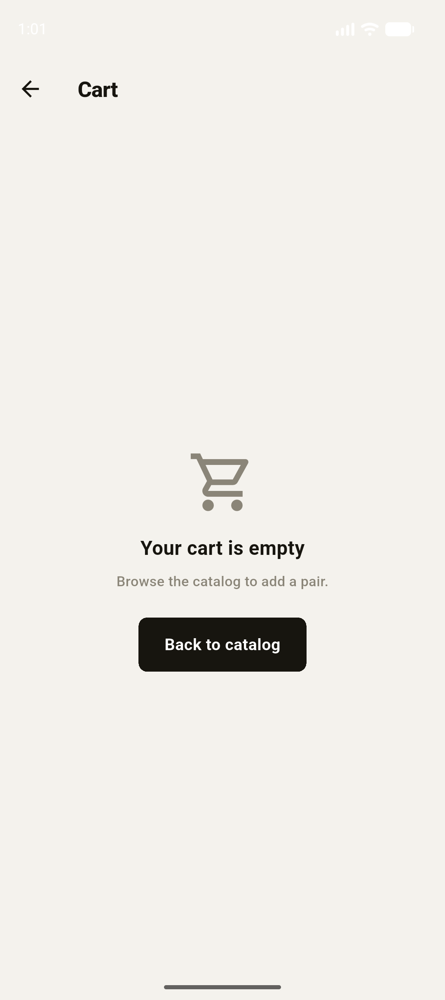

# Mini Katalog Uygulaması (Sneaker Kataloğu)

## Kısa Açıklama

Bu uygulama, spor ayakkabı ürünlerini listeleyen küçük bir katalog uygulamasıdır. Ürün verileri internetten değil, uygulamaya gömülü yerel bir JSON dosyasından (`assets/data/products.json`) okunur. Sepet özelliği yalnızca bir simülasyondur; gerçek bir ödeme işlemi yapılmaz.

## Kullanılan Flutter Sürümü

- Flutter 3.44.6 (stable kanalı)
- Dart 3.12.2

## Çalıştırma Adımları

1. Bağımlılıkları yükleyin:

   ```bash
   flutter pub get
   ```

2. Bir Android emülatörü başlatın (Android Studio → Device Manager) veya fiziksel bir cihaz bağlayın.

3. Uygulamayı çalıştırın:

   ```bash
   flutter run
   ```

## Ekran Görüntüleri









## Proje Yapısı

```
lib/
  main.dart                    # runApp, MaterialApp, tema, isimli rota tablosu
  app_routes.dart              # rota isim sabitleri
  models/
    product.dart               # Product modeli + fromJson/toJson
    cart_item.dart             # CartItem: ürün + numara + adet
  data/
    product_repository.dart    # assets/data/products.json dosyasını yükler ve ayrıştırır
  state/
    cart_state.dart            # ChangeNotifier singleton (yalnızca SDK, paket yok)
  screens/
    home_screen.dart
    detail_screen.dart
    cart_screen.dart
  widgets/
    product_card.dart
    category_chips.dart
    cart_item_tile.dart
    empty_cart_view.dart
  theme/
    app_theme.dart             # renkler, yazı stilleri, ThemeData
```
